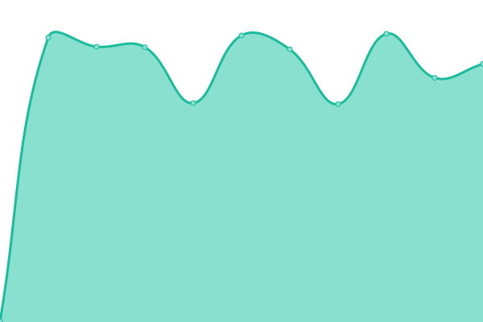
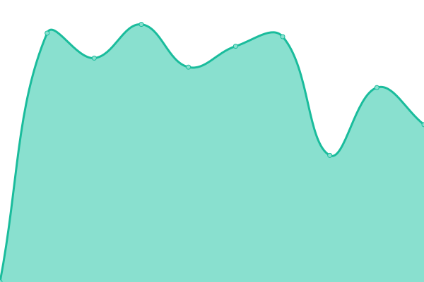

# [📈 Live Status](https://global-sistemi.github.io/vectore-status): <!--live status--> **Tutti i sistemi sono operativi**

This repository contains the open-source uptime monitor and status page for [global-sistemi](https://global-sistemi.github.io/vectore-status), powered by [Upptime](https://github.com/upptime/upptime).

With [Upptime](https://upptime.js.org), you can get your own unlimited and free uptime monitor and status page, powered entirely by a GitHub repository. We use [Issues](https://github.com/global-sistemi/vectore-status/issues) as incident reports, [Actions](https://github.com/global-sistemi/vectore-status/actions) as uptime monitors, and [Pages](https://global-sistemi.github.io/vectore-status) for the status page.

<!--start: status pages-->
<!-- This summary is generated by Upptime (https://github.com/upptime/upptime) -->
<!-- Do not edit this manually, your changes will be overwritten -->
<!-- prettier-ignore -->
| URL | Status | History | Tempo di risposta | Disponibilità |
| --- | ------ | ------- | ------------- | ------ |
|  [API Gateway](https://api.vectore.cloud/health) | 🟩 Up | [api-gateway.yml](https://github.com/global-sistemi/vectore-status/commits/HEAD/history/api-gateway.yml) | 

 445ms
     
 | 

<a href="https://status.vectore.it/history/api-gateway">100.00%</a>
    

|  [Admin SPA](https://admin.vectore.cloud) | 🟩 Up | [admin-spa.yml](https://github.com/global-sistemi/vectore-status/commits/HEAD/history/admin-spa.yml) | 

 1418ms
     
 | 

<a href="https://status.vectore.it/history/admin-spa">100.00%</a>
    

<!--end: status pages-->

[**Visit our status website →**](https://global-sistemi.github.io/vectore-status)

## 📄 License

- Powered by: [Upptime](https://github.com/upptime/upptime)
- Code: [MIT](./LICENSE) © [Anand Chowdhary](https://anandchowdhary.com), supported by [Pabio](https://pabio.com)
- Data in the `./history` directory: [Open Database License](https://opendatacommons.org/licenses/odbl/1-0/)
